# IT Help Desk Ticketing Lab

## Overview

This project demonstrates a simulated IT Help Desk environment using **Spiceworks Cloud Help Desk** to create, troubleshoot, document, and resolve common IT support tickets.

The lab simulates the complete help desk workflow:

**User reports an issue → Ticket created → Issue investigated → Troubleshooting performed → Resolution verified → Ticket documented and closed**

The environment includes a Windows client joined to an Active Directory domain. Each scenario was documented in Spiceworks as if it were handled in a real IT support environment.

---

## Technologies Used

- Spiceworks Cloud Help Desk
- Windows 11
- Windows Server
- Active Directory Domain Services (AD DS)
- Active Directory Users and Computers
- Command Prompt
- Windows Print Spooler
- TCP/IP
- DNS
- ICMP / Ping

---

# Help Desk Ticket Scenarios

This lab includes three simulated IT support tickets:

| Ticket | Issue | Priority | Category | Status |
|---|---|---|---|---|
| #3 | Password Reset Request | Medium | Other | Closed |
| #4 | Unable to Print Documents from CLIENT01 | Medium | Printer | Closed |
| #5 | Cannot Access the Internet | High | Network | Closed |

---

# Scenario 1: Password Reset Request

## Problem

A user was unable to sign in to their domain account on **CLIENT01** because they forgot their password.

A help desk ticket was created requesting a password reset.

## Troubleshooting and Resolution

1. Created a ticket in Spiceworks Cloud Help Desk.
2. Reviewed the user's issue and confirmed a password reset was required.
3. Opened **Active Directory Users and Computers**.
4. Located the user account for **David Wilson**.
5. Reset the user's password.
6. Enabled **User must change password at next logon**.
7. Verified the user was prompted to change their password.
8. Confirmed the user was able to successfully sign in.
9. Documented the resolution in Spiceworks.
10. Closed the ticket.

> ## 📸 CLICK BELOW TO VIEW PASSWORD RESET SCREENSHOTS ⬇️

<h3>🔽 CLICK HERE TO EXPAND PASSWORD RESET SCREENSHOTS 🔽</h3>

 

### Ticket Created

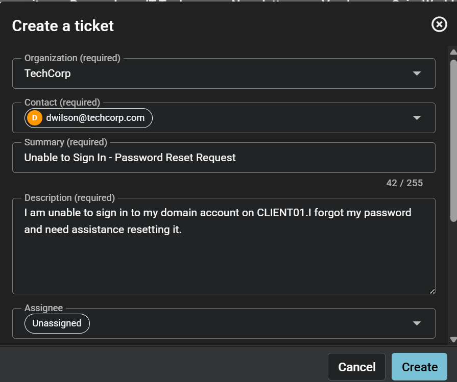

### Incorrect Password Error

### Password Reset in Active Directory

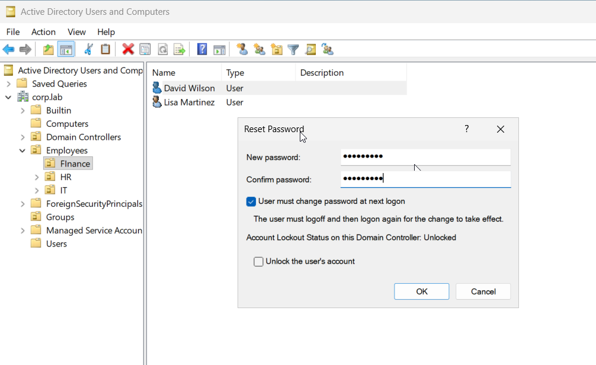

### Password Change Required at Next Logon

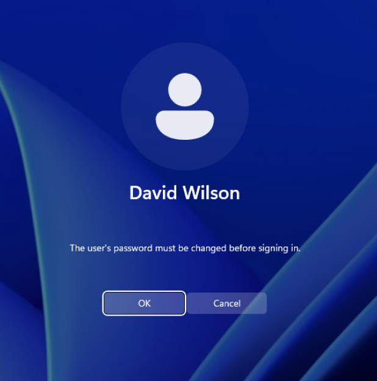

### Successful User Login

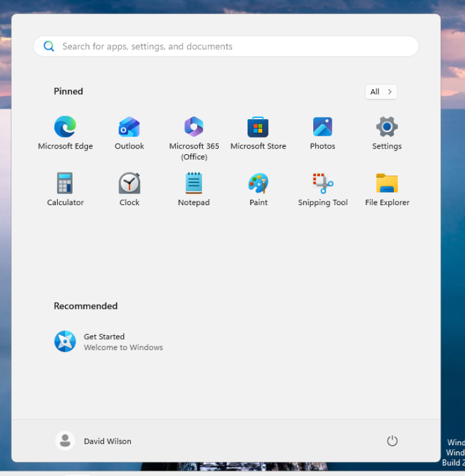

### Ticket Resolved and Closed

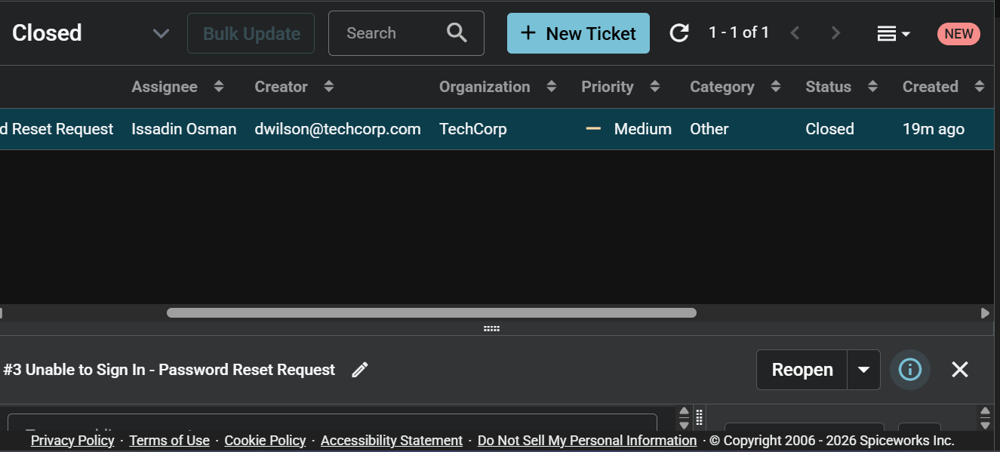

---

# Scenario 2: Printer Troubleshooting

## Problem

A user reported that they were unable to print documents from **CLIENT01**. Documents were not printing successfully and appeared to remain in the print queue.

A Spiceworks help desk ticket was created to investigate the issue.

## Troubleshooting

The Windows Print Spooler service was checked using:

~~~cmd
sc query spooler
~~~

The service was found to be **stopped**.

The Print Spooler service was then started using:

~~~cmd
net start spooler
~~~

The service status was verified again using:

~~~cmd
sc query spooler
~~~

The Print Spooler service was successfully running.

## Resolution

After starting the Print Spooler service:

1. Retested printing from CLIENT01.
2. Successfully printed a Notepad test document.
3. Used **Microsoft Print to PDF** to verify that the print job completed successfully.
4. Documented the troubleshooting steps and resolution in Spiceworks.
5. Closed the ticket.

> ## 🖨️ CLICK BELOW TO VIEW PRINTER TROUBLESHOOTING SCREENSHOTS ⬇️

<h3>🔽 CLICK HERE TO EXPAND PRINTER TROUBLESHOOTING SCREENSHOTS 🔽</h3>

 

 

### Ticket Created

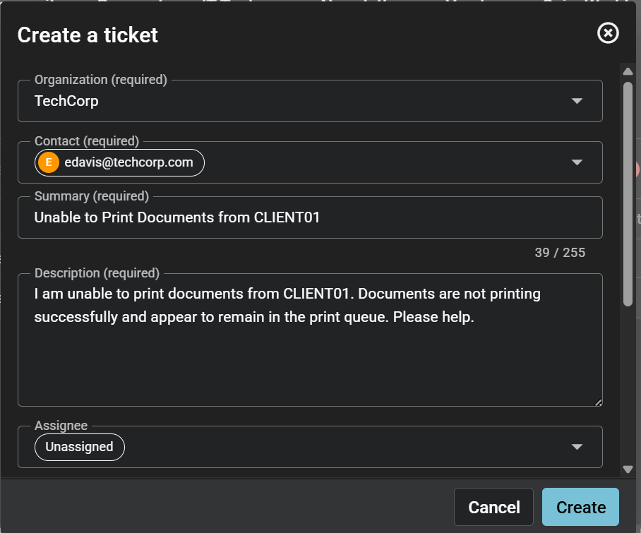

### Printer Error

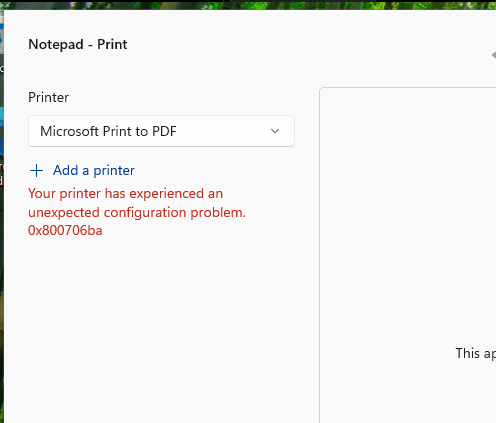

### Print Spooler Initially Stopped

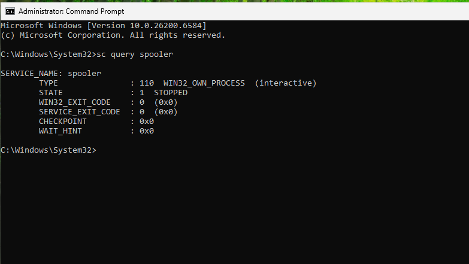

### Print Spooler Started Successfully

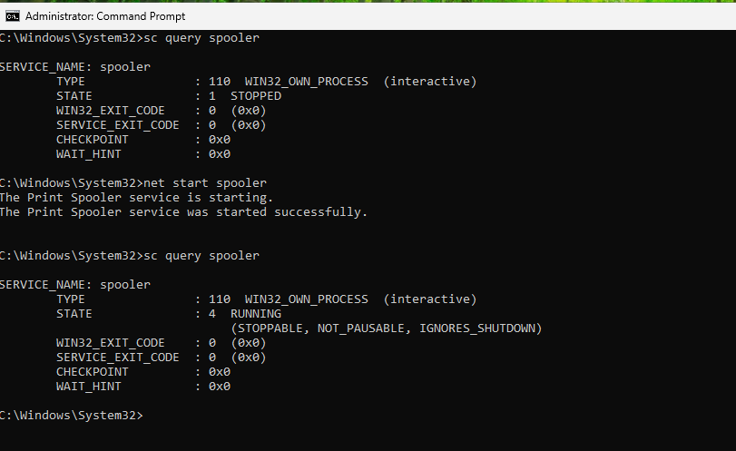

### Successful Print Test

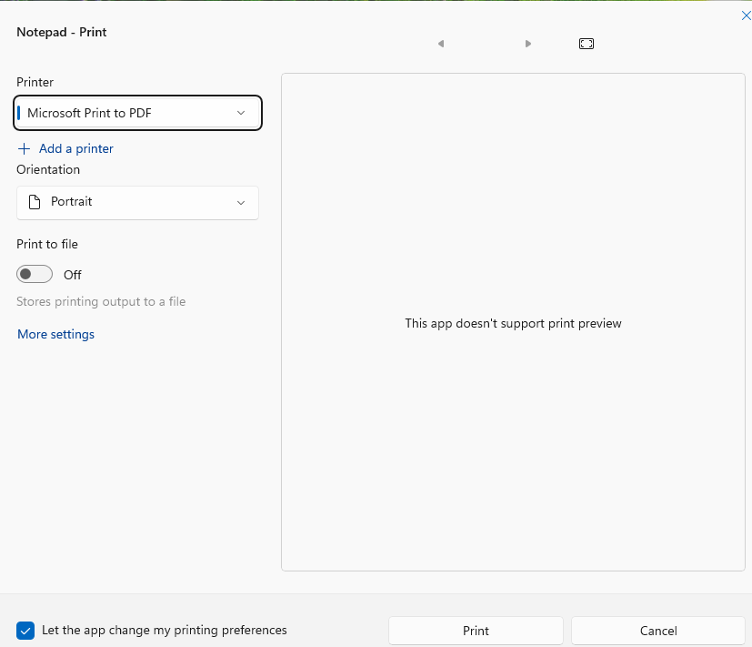

### Ticket Resolved and Closed

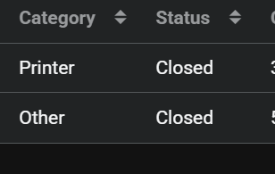

---

# Scenario 3: Network Troubleshooting

## Problem

A user reported that they were unable to access the internet from **CLIENT01**. Websites were not loading, and the user could not connect to online resources.

A high-priority network ticket was created in **Spiceworks Cloud Help Desk** to investigate the issue.

## Initial Troubleshooting

Network connectivity was tested using:

~~~cmd
ping 8.8.8.8
~~~

The initial connectivity test failed, confirming that CLIENT01 was unable to successfully reach the internet.

The network configuration was then reviewed using:

~~~cmd
ipconfig /all
~~~

The IP address, subnet mask, default gateway, and DNS configuration were reviewed to identify potential configuration issues.

The IPv4 and DNS settings were then checked and corrected.

## Resolution

After correcting the network configuration, connectivity was tested again using:

~~~cmd
ping 8.8.8.8
~~~

The ping was successful with **0% packet loss**, confirming that CLIENT01 had restored network connectivity.

The troubleshooting steps and resolution were documented in Spiceworks, and the ticket was closed.

> ## 🌐 CLICK BELOW TO VIEW NETWORK TROUBLESHOOTING SCREENSHOTS ⬇️

<h3>🔽 CLICK HERE TO EXPAND NETWORK TROUBLESHOOTING SCREENSHOTS 🔽</h3>

 

 

### Ticket Created

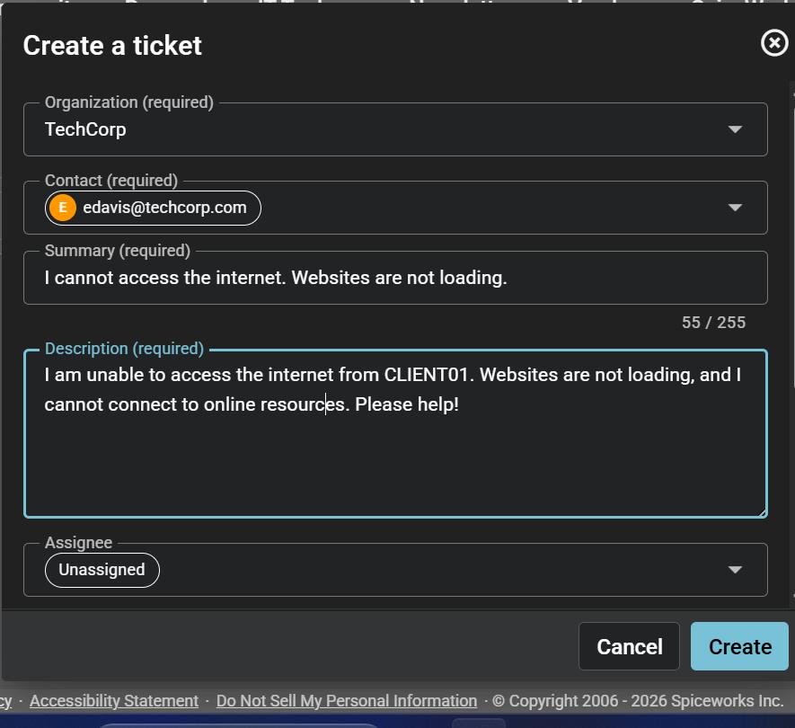

### Initial Internet Connectivity Failure

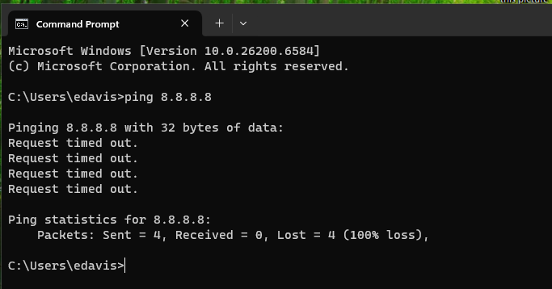

### Initial Network Configuration

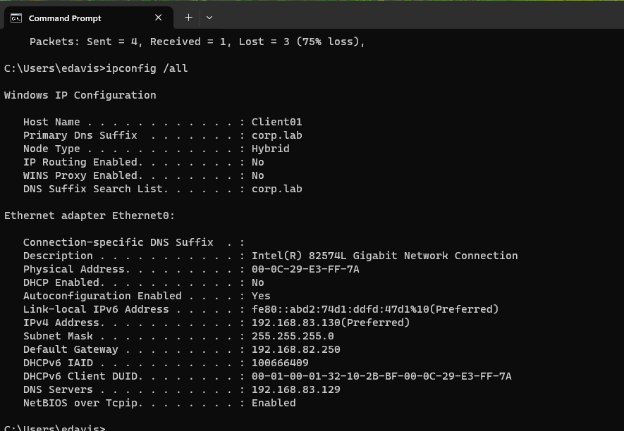

### IPv4 and DNS Configuration

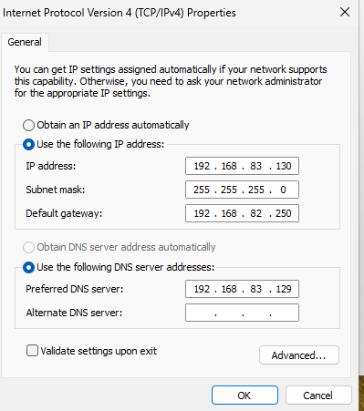

### Updated Network Configuration

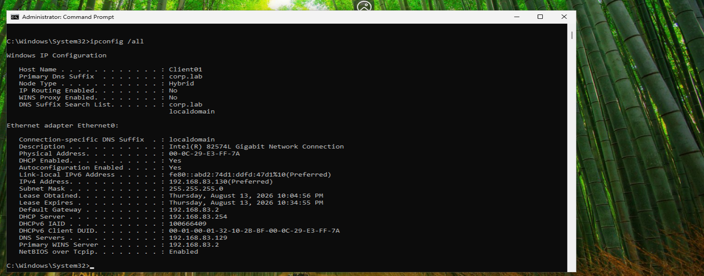

### Successful Internet Connectivity Test

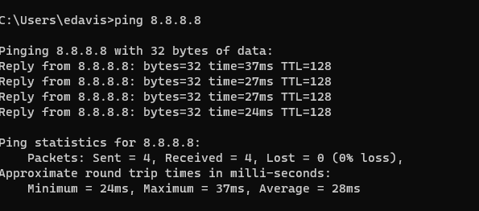

### Ticket Resolved and Closed

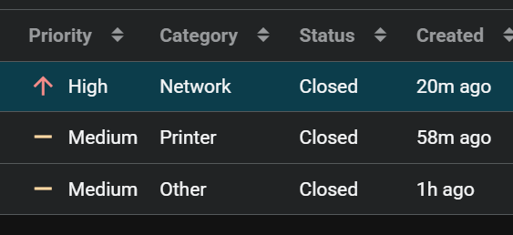

---

# Final Results

All three help desk tickets were successfully resolved and closed.

| Issue | Resolution |
|---|---|
| Password Reset | Reset the user's password in Active Directory and required a password change at next logon |
| Printing Issue | Started the Windows Print Spooler service and verified successful printing |
| Internet Connectivity | Reviewed and corrected network configuration and verified connectivity using Ping |

## Skills Demonstrated

- IT Help Desk Ticket Management
- Ticket Creation and Documentation
- Active Directory User Management
- Password Resets
- Windows Troubleshooting
- Print Spooler Troubleshooting
- Windows Services
- Command Line Troubleshooting
- Network Troubleshooting
- TCP/IP Configuration
- DNS Troubleshooting
- Connectivity Testing
- Issue Documentation
- Ticket Resolution and Closure

---

## Project Purpose

This lab was created to gain hands-on experience with common responsibilities performed by IT Help Desk and Desktop Support technicians.

The project demonstrates both technical troubleshooting skills and the ability to document issues, communicate resolutions, and manage tickets through a help desk ticketing system.
